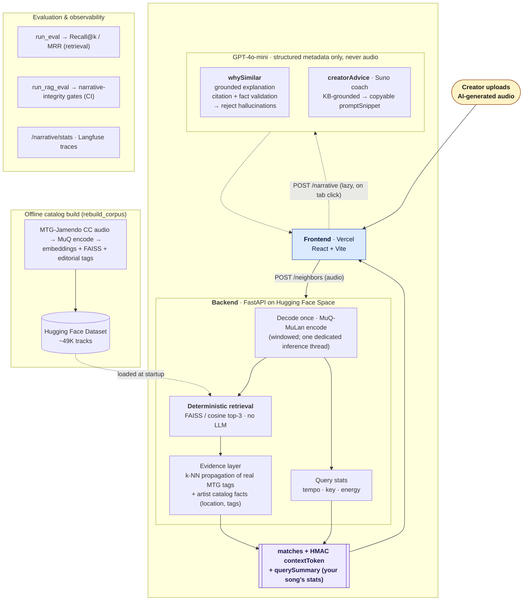

# Dundo

> *Upload an AI track. Meet the indie artists it resonates with.*

**[Live demo →](https://dundo-music.vercel.app)** &nbsp;·&nbsp; **[Backend health →](https://rajata98-dundo.hf.space/health)** &nbsp;·&nbsp; **[Decision records (ADRs) →](docs/decisions/)**

Dundo is a discovery layer for AI-music creators. Upload a Suno or Udio generation and Dundo finds the **Creative-Commons indie artists whose sound resembles yours**, explains *why* each one resonates (grounded in real evidence, never hallucinated), coaches you on making your track better in Suno, and points you to **give the artist a listen and support them**.

The name pairs with Suno: **suno** (सुनो) is Hindi for *listen*; **dundo** (ढूँढो) is Hindi for *search / find*. Suno is the listening side of AI music; Dundo is the search side.

## The direction

AI music creation has exploded — Suno alone has 100M+ users. The missing half is **discovery**: connecting the AI creator to the *human* artists whose sound they're echoing. That connection is positive-sum — the creator finds inspiration and a way to improve their track, and an under-discovered indie artist gets heard and supported. Dundo points listeners *toward* these artists; it never trains on them, and it frames everything as acoustic similarity and discovery, never copyright policing.

## What you get for an upload

- **The top 3 indie artists** by acoustic similarity to your upload — honest by default: if only one or two genuinely resonate, you see one or two, never padded to three.
- **"Why this resonates"** — a short, grounded LLM explanation that draws on the *shared sonic descriptors* and *real facts about the artist* (where they're based, what their catalog leans toward). Every fact is validated against retrieved data; anything unsupported is rejected, not shown.
- **"For your craft"** — a Suno-expert coach: two concrete moves (one to make it *resonate more*, one to make it *stand out*) plus a **copyable Suno prompt** (a Style-field line, structure metatags, and a workflow tip) tuned to *your* track's detected sound.
- **"Your song's stats"** — an honest snapshot: tempo, key, length, an energy band, and the genre/mood your track reads as.
- **"Give them a listen"** — a direct link to the artist's own music (Jamendo) plus support links, so discovery turns into action and support flows to the human artist.

## The core idea: deterministic retrieval + a fact-checked explainer

The single most important architectural property — and the one most worth understanding:

> **The matches are decided by math, not by an LLM.** Your upload is embedded with an audio model and compared to the catalog by nearest-neighbor search. The same upload always returns the same artists. **No LLM is in the retrieval path, and the LLM never hears your audio.**

The language model only *explains* an already-decided match, using structured metadata — and every claim it makes is checked:

- **Citation validation** — any cited tempo, key, or timestamp must match the supplied context (±2 BPM, exact key, ±0.5 s) or the whole explanation is rejected as `unavailable`, never rendered.
- **Fact validation** — any artist fact it asserts (a location, a genre) must be present in the retrieved catalog facts, with exact-alias matching, or it's rejected as `fact-hallucinated`.

So Dundo is a **content-based multimodal retrieval system with a retrieval-augmented, citation-and-fact-validated explanation layer.** That precision is the brand: *measured, not claimed.*

## Key engineering decision: the CLAP → MuQ-MuLan swap

The system originally ran LAION-CLAP and surfaced a real failure: every match displayed at "100% / 100% / 100%" similarity, regardless of how close the audio actually was. **Root cause was contrastive-encoder anisotropy** — the pairwise cosine distribution clustered tightly (mean 0.967, std 0.030, top-vs-random discrimination ratio only 0.036), so the UI was forced to round every distinct match to the same headline number.

After researching the 2024–2026 audio-embedding literature, the fix was to swap the encoder to **MuQ-MuLan** (Tencent AI Lab, Jan 2025, SOTA on MagnaTagATune zero-shot). **Measured on the full catalog: Recall@1 +62% (0.394 → 0.639), discrimination ratio 12× wider (0.036 → 0.451), mean random-pair cosine dropped from 0.967 to 0.456.** Both encoders' numbers are preserved in [ADR-0002](docs/decisions/0002-swap-clap-for-muq-mulan.md) so the decision stays auditable.

## Architecture



The catalog is built **offline** by `python -m backend.scripts.rebuild_corpus`: it reads `backend/catalog.yaml`, fetches CC-licensed audio, runs windowed MuQ-MuLan encoding, and writes the corpus + embeddings + FAISS index + editorial-tag sidecar to a Hugging Face Dataset. The live backend loads those at startup and serves them. **All retrieval is deterministic and content-based; the LLM is a downstream, fact-checked explainer.**

## How the pieces work

**Retrieval.** MuQ-MuLan's 512-d joint embedding, windowed over the audio, mean-pooled and L2-normalized; nearest-neighbor by cosine (NumPy sweep on small catalogs, **FAISS Flat** at scale — exact, ~328 MB for the full set, no heavier vector DB until ~1M vectors). Inference runs on **one dedicated thread** so overlapping uploads can't oversubscribe the CPU (a hard-won fix for a native-thread deadlock).

**Evidence layer.** Each catalog track carries real **MTG-Jamendo editorial tags** (genre / mood / instrument, ~99% genre coverage). The upload's own descriptors come from **k-NN tag propagation** — a similarity-weighted vote of its acoustic neighbors' real tags (validated at coverage@3 ≈ 0.93, far better than zero-shot). The overlap drives the "you both lean…" chips; the upload's full profile drives the stats panel.

**Narrative (`whySimilar`).** GPT-4o-mini with **strict JSON-schema** structured output. It grounds on the shared descriptors, the matched artist's real catalog facts (location + their own tags), and the acoustic resemblance — and emits typed citations *and* typed fact-citations that are validated before anything renders. The narrative never hears audio and never decides a match.

**Suno coach (`creatorAdvice`).** A music + Suno expert grounded in a curated knowledge base (`backend/backend/knowledge/suno_coach.md`, injected into the prompt). Given the track's detected descriptors, it returns two coaching moves and a structured, copyable `promptSnippet` — a Style-field line, Lyrics-box metatags, and a real Suno workflow move (Extend / Replace Section / Stems / …) — with hedged, honest language ("your track reads as…", "prompts guide, they don't guarantee").

**Stateless context.** `/neighbors` returns an **HMAC-signed `contextToken`** carrying the per-match metadata + the upload's descriptors + a 30-minute expiry + model/catalog hashes. `/narrative` verifies it and rebuilds context server-side — no in-memory cache to break across Space restarts or workers.

## Evaluation & observability

Two independent kinds of rigor, both surfaced on the **[/evaluation](https://dundo-music.vercel.app/evaluation)** page:

- **Retrieval quality** — `Recall@1` (0.64), `Recall@3` (0.74), `MRR` (0.69) by leave-one-out over the live catalog, plus a top-1 cosine histogram showing the noise floor on unrelated tracks. *"When Dundo says these artists sound like you, how often is it right?"*
- **Narrative integrity** — a 16-case golden-set RAG eval (`python -m backend.scripts.run_rag_eval`) that gates every CI build on five metrics at 1.0: hallucinated-citation rejection, low-confidence gating, valid-narrative acceptance, malformed-output rejection, and API-error handling. *"When Dundo explains a match, is the explanation honest?"*

**Live observability**: `GET /narrative/stats` exposes in-process counters (calls by mode / kind / error, p50/p95/p99 latency, rough cost) and **Langfuse** traces every `/narrative` call (prompt, response, latency, cost) and supports dataset/LLM-as-judge evals — no-op when keys are unset.

## Catalog & rights

The catalog is **Creative-Commons-licensed indie music** — ~49K tracks from MTG-Jamendo today. The dataset allows bulk audio download for research / non-commercial use, and every match links out to the artist's own page so users can listen and support them. There is **no commercial-catalog ingestion** and no exact-recording fingerprinting — Dundo's thesis is discovery, not copyright detection. Scaling behavior to 10⁷ tracks is argued (not yet proven) in [ADR-0003](docs/decisions/0003-catalog-scale-calibration.md).

## What Dundo deliberately does NOT do

- **No music generation** — that's Suno's product.
- **No copyright detection or risk verdict** — acoustic-similarity / discovery language only, never policing.
- **No exact-recording fingerprinting** (Shazam-style) — different problem.
- **No multimodal LLM ingest of raw audio** — the LLM receives structured metadata only.
- **No fabricated stats** — no Spotify-style danceability/valence decimals (their API was deprecated and open approximations are noisy); only what one file yields honestly + real editorial tags.
- **No premature scaling** — FAISS Flat (exact) serves the catalog; no heavier vector DB until ~1M vectors.

## Run it

```bash
# Backend (FastAPI on :8000) — MuQ ~30s cold load
pip install -e "backend/[runtime,ingest,dev]"
uvicorn backend.api:app --reload --port 8000

# Frontend (Vite on :5173)
cd quality-scorer && npm install && npm run dev

# Rebuild the catalog → quality-scorer/public/corpus/
python -m backend.scripts.rebuild_corpus

# Evals
python -m backend.scripts.run_eval       # retrieval: Recall@k / MRR → eval.json
python -m backend.scripts.run_rag_eval   # narrative integrity gates → rag_eval.json
```

## Deploy

**Hugging Face Space** (backend) + **Vercel** (frontend). Push the backend with `bash deploy/push_to_hf.sh`. Space secrets: `OPENAI_API_KEY`, `CONTEXT_TOKEN_HMAC_KEY` (`openssl rand -hex 32`), `CORS_ORIGIN`; optional `OPENAI_MODEL_ID`, `SIMILARITY_BACKEND`, and the Langfuse keys. Frontend: root `quality-scorer/`, env `VITE_API_URL` = the Space URL. Without `OPENAI_API_KEY` the app still works — `/narrative` returns `503 narrative-disabled` and the cards fall back to an honest deterministic explanation; `/neighbors` is unaffected.

## CI

- `test.yml` — backend pytest (fast).
- `frontend.yml` — Vitest + `npm run build`.
- `eval-check.yml` — re-runs the retrieval eval when eval inputs or the corpus change.

The narrative-integrity gate (`run_rag_eval`, all five metrics at 1.0) must pass before a build ships.

## License

MIT. See `LICENSE`.
