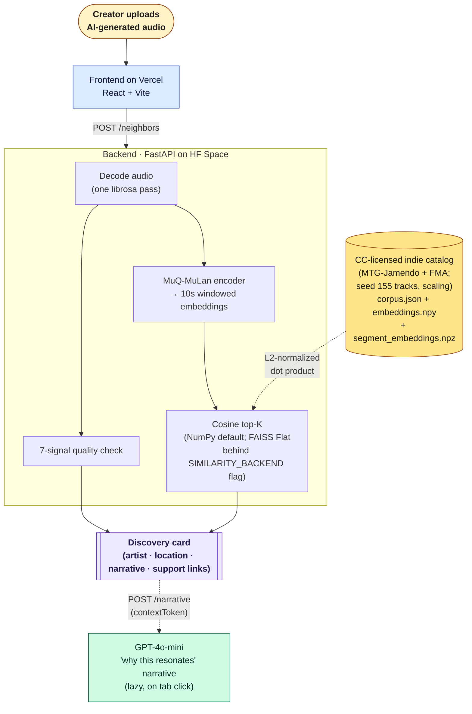

# Dundo

> *Upload an AI track. Find the indie artists it resonates with.*

**[Live demo →](https://dundo-xi.vercel.app)** &nbsp;·&nbsp; **[Backend →](https://rajata98-dundo.hf.space/health)** &nbsp;·&nbsp; **[Decision record →](docs/decisions/0001-similarity-calibration.md)** &nbsp;·&nbsp; **[Engineering arc that led here → PiedPiper](https://github.com/RajatA98/PiedPiper)**

Dundo is a discovery layer for AI music creators. Upload a Suno or Udio generation; Dundo retrieves a small set of Creative-Commons-licensed indie artists whose sound resembles your upload, explains *why* each one resonates with what you made, and points you at how to support them.

The name pairs deliberately with Suno: **suno** (सुनो) is Hindi for *listen*; **dundo** (ढूंढो) is Hindi for *search* / *find*. Suno is the listening side of AI music; Dundo is the search side.

## What you get for an upload

- **3–5 indie artists** ranked by acoustic similarity to your upload, retrieved via MuQ-MuLan's 512-d joint embedding space.
- **A short LLM-grounded "why this resonates with what you made"** paragraph per match — citing the exact tempo, key, and chord-palette evidence from the four-criterion MIR layer (ADR-0004), never hallucinated.
- **A visible criteria comparison** (tempo / key / harmonic / timbre) per match.
- **A side-by-side spectrogram view** of the matched 10-second window — for when you can't trust your ears alone.
- **Direct support links** (Bandcamp / Spotify / Patreon) so the discovery turns into action.
- **Coming soon**: live-show data via Bandsintown — see where the artists who resonate with your sound are playing.

## Why Dundo, why now

The licensing wall for commercial big-artist catalogs is real: a portfolio project that needs major-label rights to retrieve "the song that sounds like your AI generation" can't reach production scale. The Creative-Commons indie catalog *doesn't* have that wall. There are ~55K MTG-Jamendo and ~106K Free Music Archive tracks legally bulk-ingestible today. Dundo retrieves from that pool.

The pivot also fixes the framing problem: a tool that says *"your AI track might be too close to this copyrighted song — risk verdict"* is defensive. A tool that says *"you generated music like this — meet the human artist whose sound resonates with what you made, and here's where they're playing"* is positive-sum. AI creator finds inspiration. Indie artist gets discovered. Local venue fills seats.

## Key engineering decision: the CLAP → MuQ-MuLan swap

The system originally ran LAION-CLAP. The live demo surfaced a real failure: every match displayed at "100% / 100% / 100%" similarity, regardless of how close the underlying audio actually was. **Root cause was contrastive-encoder anisotropy** — the pairwise cosine distribution across the catalog clustered tightly (mean 0.967, std 0.030, top-vs-random discrimination ratio only 0.036), so the UI was forced to round all distinct matches to the same headline number. After researching the 2024-2026 audio embedding literature, the fix was to swap the encoder: LAION-CLAP → MuQ-MuLan (Tencent AI Lab, Jan 2025 SOTA on MagnaTagATune zero-shot). **The measured result on the full catalog: Recall@1 +62% (0.394 → 0.639), discrimination ratio 12× wider (0.036 → 0.451), mean random-pair cosine dropped from 0.967 to 0.456.** Both encoders' numbers are preserved in [ADR-0002](docs/decisions/0002-swap-clap-for-muq-mulan.md) so the decision stays auditable.

**Independent verification.** The matching pipeline is checked end-to-end by `backend/backend/scripts/verify_matching.py` — for each catalog track, the script re-uploads its preview to `/neighbors` and asserts the same track is returned at rank 1 with cosine ≈ 1.0. Latest run: 10/10 self-retrieval at rank 1, mean self-cosine 0.9988.

**Decomposed similarity.** One cosine doesn't defend "similar." [ADR-0004](docs/decisions/0004-multi-criterion-similarity.md) adds four classical MIR criteria — tempo, key+mode, harmonic content (chroma), timbre (MFCC) — surfaced per neighbor with a per-criterion agreement score and label ("same key," "4 BPM apart," "similar production feel"). Math is librosa-native, no new dependencies. The criteria layer is additive — top-K ordering still comes from MuQ-MuLan cosine.

## RAG-style evidence layer

Dundo is a **RAG-style discovery layer**: MuQ-MuLan retrieves nearest indie artists, MIR metadata (ADR-0004) grounds the explanation, and an LLM narrates the evidence. The pipeline maps onto the [Gauntlet-AIDP rag-cookbook](https://github.com/Gauntlet-AIDP/rag-cookbook) ladder honestly: **Rung 1 (Naive RAG)** for retrieval + **metadata-grounded generation at presentation time** for the explanation. The cookbook's central rule is "refuse to climb without measured evidence," and this project respects it — no Hybrid (no text query), no Graph (no measured benefit), no Agentic (premature). See [ADR-0005](docs/decisions/0005-rag-narrative-and-visual-match.md).

Three tabs land in the row expansion:

- **"Why these are similar"** — `POST /narrative` (GPT-4o-mini). The model receives structured metadata only (it does **not** hear audio) and emits a grounded paragraph with structured citations. Every cited criterion value is validated against the supplied context — hallucinated tempo, wrong-track citations, or out-of-window timestamps are rejected and surfaced as `unavailable`, never rendered as if they were real.
- **"Make mine more distinctive"** — same endpoint, mode `creatorAdvice`. Concrete creator-feedback tied to the specific criterion that drove the match.
- **"Visual match"** — no LLM. WaveSurfer.js spectrograms of both windows with the matched 10-second band highlighted.

The `/neighbors` response carries an HMAC-signed `contextToken` containing the per-neighbor metadata fragments + a 30-minute expiry + the current model + catalog hashes. `/narrative` accepts `{contextToken, trackId, mode}`, verifies the token, and rebuilds context server-side — stateless across HF Space restarts and workers, no in-memory cache to break under load.

**Observability**: `GET /narrative/stats` returns in-process counters (calls, by mode, by kind, by error code, p50/p95/p99 latency, rough cost estimate in cents). A 12-case RAG eval harness (`python -m backend.scripts.run_rag_eval`) runs offline on every CI build and gates merges on five baseline metrics: happy-path kind agreement, low-context gate correctness, hallucination rejection, malformed rejection, OpenAI error handling — all must be 1.0.

**Honest cost framing**: single-digit cents to low dollars depending on traffic, prompt size, and cache hit rate. No fixed per-request guarantee. Cost guardrails: lazy load (only on tab click), canonical cache, prompt-size cap (8 KB), no retry loops, no-key disable path (503 narrative-disabled when `OPENAI_API_KEY` is unset).

## Architecture



The catalog is built offline by `python -m backend.scripts.rebuild_corpus`, which reads `backend/catalog.yaml`, fetches CC-licensed audio (Jamendo CDN + FMA bulk), runs windowed MuQ-MuLan encoding on every track, and writes five files to `quality-scorer/public/corpus/`. The live backend reads those files at startup and serves them via `/neighbors`.

## Why these technical choices

**Audio embedding model: MuQ-MuLan 512-d** (`OpenMuQ/MuQ-MuLan-large`, Tencent AI Lab, January 2025 SOTA on MagnaTagATune zero-shot). CC-BY-NC 4.0 (non-commercial portfolio use), ~700M parameters, ~0.8 s per 10-second window on CPU. The encoder also has a text branch — Dundo uses it for zero-shot genre tagging and for the style-attribution fallback ("sounds like vintage crooner / 80s synth-pop") when no catalog match crosses threshold.

**Vector search: in-memory NumPy cosine sweep.** At the current catalog size a sweep is sub-millisecond. FAISS Flat is wired behind `SIMILARITY_BACKEND=faiss` and becomes the right call ~10K tracks (measured in `backend/backend/scripts/bench_similarity.py`). LanceDB or Qdrant become the right call ~100K+ tracks. The ladder is climbable; the climb has trigger conditions, not preemptive complexity.

**Backend hosting: Hugging Face Space CPU Basic (free).** Cultural signal aside, the 48-hour sleep is mitigated by a daily UptimeRobot ping to `/health`. Modal is the documented migration target when cold starts ever degrade the reviewer experience.

**Track-length normalization: 10-second windows, L2-normalized mean pooling.** Catalog previews are 30 s (3 windows); uploaded queries are capped at 90 s (up to 9 windows). The response surfaces both `meanPooledSimilarity` (the headline rank) and `maxSegmentSimilarity` (local resemblance the mean would wash out).

**Single threshold for "completely unique"** (provisional `0.70`), recalibrated from the observed top-1 cosine distribution on the negatives in the golden set. Above threshold → discovery card with artist + narrative. Below threshold → style-attribution fallback ("sounds like vintage crooner / 80s synth-pop") via the same MuQ-MuLan text branch.

## Rights and catalog

The catalog is **Creative-Commons licensed indie music**. Today's seed is ~145 tracks from MTG-Jamendo (Phase 1 ingest); the planned expansion targets ~10K then 50K+ via MTG-Jamendo's full 55K + Free Music Archive's 106K. Both datasets allow bulk audio download for research + non-commercial use; each match links out to the artist's Jamendo / FMA / Bandcamp page so users can act on the discovery.

There is no commercial-catalog ingestion. There is no Apple iTunes Tier-1 anymore — that was a PiedPiper-era demo aid retired in the pivot to keep the licensing story clean. There is no ACRCloud — also retired; Dundo's thesis is discovery, not commercial-second-opinion copyright detection.

The companion question — *will the system's verdict survive when the catalog is 10⁷ tracks instead of 145?* — is answered in [ADR-0003: density-relative calibration](docs/decisions/0003-catalog-scale-calibration.md). The mechanism is argued, not proven at scale; the ADR is honest about that.

## What Dundo deliberately does NOT do

- **No music generation.** That is Suno's product.
- **No copyright detection or risk verdict.** Acoustic-similarity language only. The framing is discovery, never policing.
- **No exact-recording fingerprinting** (Shazam-style). Different problem.
- **No commercial-catalog ingestion.** CC + public-domain only.
- **No multi-modal LLM ingest of raw audio.** The LLM receives structured metadata only.
- **No user accounts or persistence.** Stateless demo.
- **No "near you" geographic personalization in v1.** Artist's city is shown; user-location-based filtering is a later iteration.
- **No premature scaling climb.** NumPy retrieval until measured pressure justifies FAISS Flat (~10K tracks).

## Roadmap

- **Bandsintown integration** — add live-show data ("Maya Lev plays The Bowery in Brooklyn next Thursday") behind a `BANDSINTOWN_APP_ID` secret. Nullable: cards without show data just don't render that row.
- **Style attribution row in Case B** — when no catalog match crosses threshold, render "sounds like vintage crooner / 80s synth-pop / lo-fi hip-hop" using the MuQ-MuLan text branch over a curated vocabulary.
- **Catalog scale to ~10K then ~50K+** via full MTG-Jamendo + FMA bulk ingest. The FAISS Flat backend is wired and waiting.
- **Strict `response_format=json_schema`** in the narrative call (currently `json_object`; planned tightening to eliminate the residual Pydantic-validation failures from GPT-4o-mini's looser output mode).

See `factory/artifacts/PIVOT_PRD.md` for the full product spec.

## Evaluation

The `/evaluation` page reports:

- **`Recall@1`, `Recall@3`, `MRR`** on the catalog's leave-one-out set.
- **Top-1 cosine histogram** on the negatives. Dashed vertical line at the `0.70` threshold is where the distribution's tail thins.
- **Named false-positive + false-negative examples** with audio + a one-sentence "why I think this happened" note.
- **A short methodology paragraph** documenting the golden set construction.
- **Limitations paragraph** naming catalog size, generator coverage, and known biases.

## Run it

### Prerequisites

- Python 3.11+
- Node 18+
- A clone of this repo

### Backend (FastAPI on local 8000)

```bash
pip install -e "backend/[runtime,ingest,dev]"
uvicorn backend.api:app --reload --port 8000
```

`/health` should return `ok: true` once MuQ finishes loading (~30 s cold start).

### Frontend (Vite on local 5173)

```bash
cd quality-scorer
npm install
npm run dev
```

### Rebuild the catalog

```bash
python -m backend.scripts.rebuild_corpus
# Writes corpus.json + embeddings.npy + segment_embeddings.npz + manifest.json + examples.json
# to quality-scorer/public/corpus/.
```

### Run the eval

```bash
python -m backend.scripts.run_eval
# Writes eval.json + golden_set.json. The /evaluation page reads these at runtime.
```

## Deploy

Production deploy is **Hugging Face Space** (backend) + **Vercel** (frontend) + **UptimeRobot** (keepalive ping). Both hosts have a $0 free tier that sustains the demo workload.

### 1. Backend — Hugging Face Space

```bash
bash deploy/push_to_hf.sh
# One-shot: clones the HF Space repo with token from ~/.cache/huggingface/token,
# overlays the latest backend code via sync_to_hf.sh, commits + pushes.
# Requires git-lfs installed locally for the corpus binaries.
```

Then in the Space's **Settings → Variables and secrets**:

- `CORS_ORIGIN` (variable) — Vercel production URL.
- `OPENAI_API_KEY` (secret) — powers the `/narrative` RAG explanatory layer. Without it, `/narrative` returns `503 narrative-disabled` and the frontend tabs show a typed fallback panel; `/neighbors` is unaffected.
- `CONTEXT_TOKEN_HMAC_KEY` (secret) — signs the opaque `contextToken` `/neighbors` attaches. Generate with `openssl rand -hex 32`.
- `OPENAI_MODEL_ID` (optional variable) — defaults to `gpt-4o-mini`.
- `SIMILARITY_BACKEND` (optional variable) — `numpy` (default) or `faiss` to enable the FAISS Flat backend.
- `BANDSINTOWN_APP_ID` (optional secret, coming) — enables the live-show row on each discovery card.

First build takes ~8 min (pulls torch + MuQ weights). After it boots, hit `https://rajata98-dundo.hf.space/health` → `{"ok": true, "corpus": <N>, ...}`.

### 2. Frontend — Vercel

1. Push this repo to GitHub.
2. In Vercel, **New Project → Import Git Repository** → pick the Dundo repo. Root directory: `quality-scorer/`. Framework preset auto-detects Vite.
3. Environment variable: `VITE_API_URL` = `https://rajata98-dundo.hf.space`.
4. Deploy. The prod URL appears on the dashboard.
5. Back in the Space, update `CORS_ORIGIN` and restart the Space.

### 3. Keepalive — UptimeRobot

Free CPU Basic Spaces sleep after ~48 hours idle. UptimeRobot's free tier covers a 5-minute `/health` ping that keeps the Space warm during the demo window.

## CI

Three GitHub Actions workflows run on every push:

- `.github/workflows/test.yml` — backend pytest (fast tests only).
- `.github/workflows/frontend.yml` — Vitest + `npm run build`.
- `.github/workflows/eval-check.yml` — re-runs `python -m backend.scripts.run_eval` on PRs that touch eval inputs or the corpus.

## Credits

Dundo is forked from [PiedPiper](https://github.com/RajatA98/PiedPiper), the original "acoustic-similarity scanner for AI-generated music" project. The MuQ-MuLan retrieval pipeline (ADR-0002), four-criterion similarity layer (ADR-0004), RAG narrative layer with HMAC-signed context tokens (ADR-0005), FAISS Flat backend behind the `SIMILARITY_BACKEND` flag, verification harness, and test suite all carry over from there. PiedPiper remains open as the engineering provenance and the historical decision arc that led to Dundo's positioning. See `factory/artifacts/_PREPIVOT/` for the full audit trail of the PiedPiper work, and `JOURNEY.md` for the chronological story of how we got here.

## License

MIT. See `LICENSE`.
